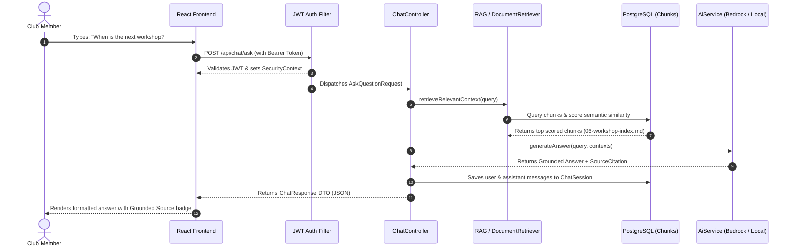

# System Architecture & Technical Specifications

## 1. Architectural Style: Modular Monolith

The backend is built as a modular Spring Boot 3.3.x monolith written in Java 21, designed to minimize operational complexity for the hackathon prototype while maintaining clean hexagonal boundaries that can easily decompose into microservices or serverless functions if required.

```
club-member-portal/
├── backend/
│   ├── src/main/java/com/aws/sbg/
│   │   ├── config/          # Spring Security, CORS, Application configs
│   │   ├── controller/      # REST API Controllers
│   │   ├── dto/             # Data Transfer Objects & Validation rules
│   │   ├── entity/          # JPA Domain Entities
│   │   ├── repository/      # Spring Data JPA Repositories
│   │   ├── service/         # Business Logic & Orchestration
│   │   ├── security/        # JWT Filter, Token Provider, UserDetails
│   │   ├── rag/             # Markdown Parser, Chunker, Retriever
│   │   ├── ai/              # AiService abstraction & Bedrock client
│   │   ├── exception/       # Global Exception Handler & Custom Errors
│   │   └── util/            # Constants & Utilities
│   └── src/main/resources/
│       ├── application.properties
│       ├── application-local.properties
│       └── application-postgres.properties
├── frontend/
│   ├── src/
│   │   ├── components/      # Reusable React UI Components
│   │   ├── pages/           # View Route Pages
│   │   ├── services/        # Fetch API Services
│   │   ├── context/         # AuthContext & ToastContext
│   │   ├── types/           # TypeScript Data Interfaces
│   │   └── styles/          # Design Tokens & Main CSS
├── documents/               # 8 Authoritative Markdown Files
├── database/                # Schema DDL & Init Scripts
├── docs/                    # Complete Documentation Suite
├── docker-compose.yml       # PostgreSQL 16 + pgvector container
└── README.md
```

## 2. Component Interactions & Sequence Flow



## 3. Extensibility for 30% Hackathon Problem Statement

The system was engineered specifically so that additional hackathon features (the remaining 30%) can be plugged in without refactoring core systems:
- **Additional Document Types**: The `MarkdownDocumentParser` can easily accept PDF, DOCX, or HTML inputs via Apache Tika.
- **Enhanced Vector Models**: The `AiService` interface allows swapping between Local Grounded, Bedrock Titan, Claude 3, and OpenAI.
- **Database Scalability**: The entity model separates users, documents, chunks, and sessions cleanly with indexed foreign keys.
