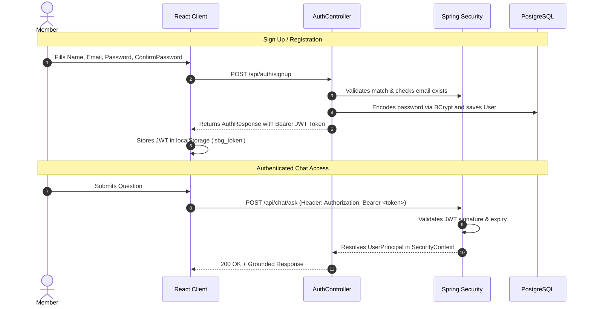

# Authentication & Security Architecture

## 1. Authentication Strategy

The Club Member Portal uses **Stateless JSON Web Token (JWT)** authentication coupled with **Spring Security 6** and **BCrypt (12 rounds)** password hashing.

### Flow Diagram

## 2. Password Reset Workflow

1. **Request**: User navigates to `/forgot-password` and inputs their email.
2. **Token Generation**: `AuthService` generates a cryptographically random UUID token with a 30-minute expiration and saves it in `password_reset_tokens`.
3. **Dispatch**: In local development, the reset link is output to the simulator console. In cloud production, it is dispatched via **Amazon SES**.
4. **Protection**: To prevent email enumeration attacks, the API always returns a 200 OK generic success message regardless of whether the email exists in the database.
5. **Reset Execution**: User visits `/reset-password?token=...`, enters their new password and confirmation. The backend validates token validity, non-expiry, and unused status, updates the password using BCrypt, and marks the token as used.

## 3. Strict Zero-Logging Security Policy

- **No Passwords in Logs**: Passwords and cleartext credential inputs are never printed to logs or traces.
- **No Secret Key Leakage**: JWT secrets, database passwords, and AWS credentials are read exclusively from environment variables and `.env`.
- **Guest Restriction**: All chat endpoints (`/api/chat/**`) and member profile endpoints (`/api/users/**`) are strictly guarded behind `authenticated()` filters.
