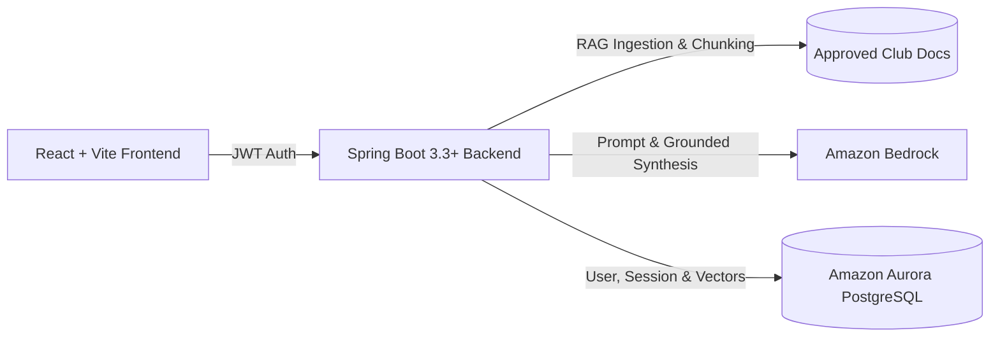

# Building an Intelligent Club Member Portal for AWS Student Builder Groups with Java Spring Boot and Amazon Bedrock

*By Team RABI — AWS Student Builder Group*

---

## Introduction

At university campuses worldwide, **AWS Student Builder Groups (SBGs)** empower students to collaborate, build cloud-native applications, prepare for AWS certifications, and publish community articles on **AWS Builder Center**. 

However, as a club scales past dozens of active builders, leaders face a recurring challenge: answering the same onboarding inquiries about Free Tier safety, workshop locations, Bedrock API credentials, and hackathon guidelines.

To solve this, we engineered the **Club Member Portal** — a full-stack web application featuring a **Java 21 Spring Boot backend**, **React frontend**, and a **Retrieval-Augmented Generation (RAG) AI assistant** grounded strictly in approved club documents.

---

## System Architecture Overview

### Key Technical Pillars:
1. **Modern Enterprise Backend**: Built on Java 21 and Spring Boot 3.3 with Spring Security, Spring Data JPA, and BCrypt salted password hashing.
2. **Deterministic RAG Ingestion**: Markdown documents are parsed into hierarchical sections, preserving full context and heading metadata without summarization loss.
3. **Strict AI Safety & Safe Fallback**: If a query cannot be answered with high confidence from approved club files, the system refuses to speculate and provides the verified contact information of chapter leadership.

---

## Designing for the AWS Cloud

While our prototype operates locally with containerized PostgreSQL, we designed the entire system to transition seamlessly to AWS managed services:

- **Identity & Authentication**: **Amazon Cognito** handles student registration, email verification, and token issuance.
- **Transactional Notifications**: **Amazon SES** manages self-service password reset emails.
- **Document Storage & Knowledge Base**: **Amazon S3** stores club guides, triggering automated re-indexing in **Amazon Bedrock Knowledge Bases**.
- **AI Foundation Models**: **Amazon Bedrock** (using Anthropic Claude 3 Haiku) delivers sub-second, grounded conversational responses.
- **Containerized Compute**: The Spring Boot backend runs on **AWS App Runner** or **Amazon ECS (Fargate)** with auto-scaling.
- **Managed Database**: **Amazon Aurora Serverless PostgreSQL** with `pgvector` stores student profiles and chat histories.

---

## Key Learnings for Student Builders

1. **RAG Quality depends on Chunk Integrity**: Splitting by semantic section headings (`#`, `##`) rather than arbitrary character counts drastically improves retrieval accuracy.
2. **Citations Build Trust**: Showing students the exact filename (`06-workshop-index.md`) and section (`Next workshop`) eliminates ambiguity.
3. **Safe Fallbacks Prevent Hallucinations**: In education and community settings, knowing when to route a user to a human leader (*Shanmukha Sasi Sadineni*) is as vital as answering the question itself.

---

## Conclusion & Next Steps

The Club Member Portal demonstrates how modern Java enterprise frameworks can pair with generative AI on AWS to deliver reliable, student-centric tools. We encourage every Student Builder Group to deploy their own grounded member assistant and share their journey on AWS Builder Center!
