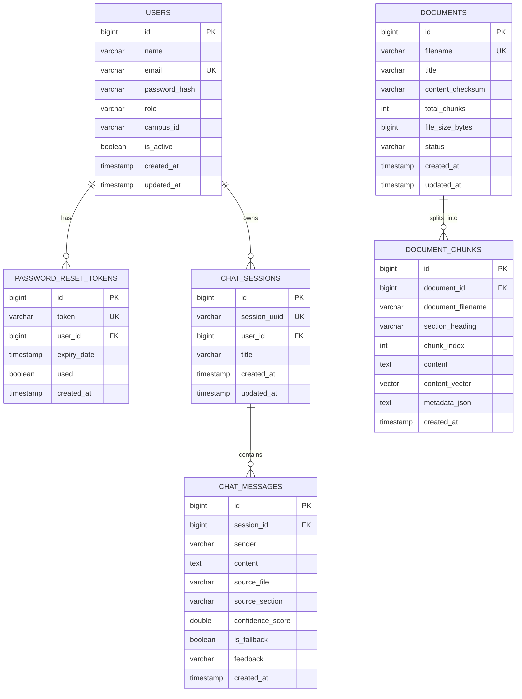

# Database Design & Schema Specifications

## 1. Relational Entity Relationship Diagram

## 2. Table Specifications

### 2.1 `users`
- `id` (BIGSERIAL, PRIMARY KEY): Unique identifier.
- `name` (VARCHAR(100), NOT NULL): Full name of the member.
- `email` (VARCHAR(255), NOT NULL, UNIQUE, INDEXED): Campus email used for authentication.
- `password_hash` (VARCHAR(255), NOT NULL): BCrypt salted password hash (never plain text).
- `role` (VARCHAR(50), NOT NULL): Enum (`ROLE_MEMBER`, `ROLE_LEAD`, `ROLE_ADMIN`).
- `campus_id` (VARCHAR(100)): Optional university student ID.
- `is_active` (BOOLEAN, DEFAULT TRUE): Account active status.

### 2.2 `password_reset_tokens`
- `id` (BIGSERIAL, PRIMARY KEY): Unique identifier.
- `token` (VARCHAR(255), NOT NULL, UNIQUE, INDEXED): Cryptographically secure random UUID token.
- `user_id` (BIGINT, FOREIGN KEY -> `users(id)`): Linked user.
- `expiry_date` (TIMESTAMP WITH TIME ZONE, NOT NULL): Default 30 minutes from creation.
- `used` (BOOLEAN, DEFAULT FALSE): Prevents token reuse.

### 2.3 `documents`
- `id` (BIGSERIAL, PRIMARY KEY): Unique document ID.
- `filename` (VARCHAR(255), NOT NULL, UNIQUE): Exact markdown filename (e.g. `01-onboarding-faq.md`).
- `title` (VARCHAR(255), NOT NULL): Extracted document title (from `# Heading`).
- `content_checksum` (VARCHAR(64), NOT NULL): SHA-256 hash to prevent duplicate chunking.
- `total_chunks` (INT, NOT NULL): Number of section chunks generated.
- `file_size_bytes` (BIGINT, NOT NULL): File size in bytes.

### 2.4 `document_chunks`
- `id` (BIGSERIAL, PRIMARY KEY): Unique chunk ID.
- `document_id` (BIGINT, FOREIGN KEY -> `documents(id)`): Parent document reference.
- `document_filename` (VARCHAR(255), NOT NULL): Authoritative filename for fast citation lookups.
- `section_heading` (VARCHAR(255), NOT NULL, INDEXED): Section heading name.
- `chunk_index` (INT, NOT NULL): Sequential index within the document.
- `content` (TEXT, NOT NULL): Full unaltered section text.
- `metadata_json` (TEXT): JSON containing title, filename, and section tags.

### 2.5 `chat_sessions` & `chat_messages`
- Groups chat turns into named sessions per member.
- Stores user questions alongside assistant answers, source filenames, section headings, confidence metrics, and thumbs up/down user feedback.
