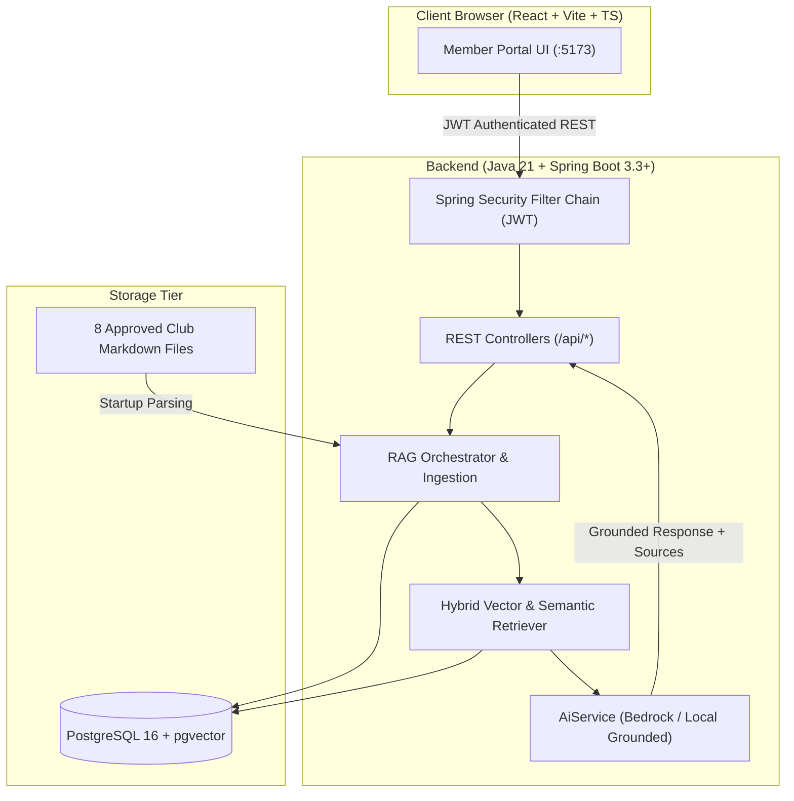

# Comprehensive Project Explanation — Student Builder Groups Club Member Portal

## 1. What is this project?
The **Student Builder Groups Club Member Portal** is a web portal built to connect university students in AWS Student Builder Groups with the resources, knowledge, and leadership of their chapter. It includes a full authentication suite, a dashboard for exploring approved club documents, and an intelligent AI chat system that answers student questions accurately using Retrieval-Augmented Generation (RAG).

## 2. Why does it exist?
When students join an AWS Student Builder Group, they are eager to start building projects, attend workshops, and publish articles on AWS Builder Center. However, finding specific details about meeting times, room locations, account billing safety, or hackathon rules can be overwhelming. This portal provides an always-available, accurate digital mentor that answers member questions instantly while citing the exact source documents.

## 3. Who uses it?
- **Club Members**: Student builders who ask questions, prepare for workshops, check rules, and get direct assistance.
- **Club Leaders**: Chapter organizers (Leader Shanmukha Sasi Sadineni, Technical Lead Revan Kumar Goud Bommagoni, and directors) who maintain approved documentation and guide students.

## 4. End-to-End System Architecture

## 5. Detailed Component Walkthrough

### 5.1 Frontend (React, Vite, TypeScript, Vanilla CSS)
The frontend provides a human-crafted, responsive interface:
- **Landing Page (`/`)**: Welcomes visitors, explains the club's mission, displays meeting times, and invites members to sign up.
- **Sign Up (`/signup`)**: Clean registration form capturing student name, campus email, student ID, and secure password.
- **Login (`/login`)**: Authenticates members and stores stateless JWT tokens.
- **Forgot Password (`/forgot-password`) & Reset Password (`/reset-password`)**: Self-service password recovery flow.
- **Member Dashboard (`/dashboard`)**: Displays chapter announcements, starter prompt cards, recent conversations, and indexed document statuses.
- **AI Chat (`/chat`)**: Full conversational chat stream with source cards, copy actions, thumbs up/down feedback, and conversation history sidebar.
- **Profile (`/profile`)**: Account details and sign out.
- **Page Not Found (`*`)**: Graceful 404 recovery.

### 5.2 Backend (Java 21 + Spring Boot 3.3+)
Structured as a modular monolith adhering to clean architecture:
- **`config`**: Security filter chain, CORS origins, and RAG configuration.
- **`controller`**: REST controllers exposing typed endpoints with DTO validation.
- **`service`**: Business logic orchestration (`AuthService`, `ChatService`, `DocumentIngestionService`, `UserService`, `EmailService`).
- **`security`**: BCrypt hashing, JWT generation/validation, custom user details service.
- **`rag`**: Markdown AST parser, section chunker, and hybrid semantic retrieval engine.
- **`ai`**: `AiService` interface with `LocalGroundedAiService` and `BedrockAiService`.
- **`repository`**: Spring Data JPA repositories with custom queries and index mappings.
- **`entity`**: Relational database entities.

### 5.3 Database Design (PostgreSQL 16)
Relational tables with foreign key constraints, indexes, and pgvector readiness:
- `users`: Member profiles, roles, and salted password hashes.
- `password_reset_tokens`: Cryptographically random reset tokens with 30-minute expiry and usage tracking.
- `documents`: Authoritative document metadata, checksums, and chunk counts.
- `document_chunks`: Extracted sections, headings, content, and metadata JSON.
- `chat_sessions`: Grouped conversation threads per member.
- `chat_messages`: Stored conversation turns, citations, confidence scores, and member feedback.

### 5.4 Authentication & Security
- **Stateless JWT**: Standard Authorization Bearer token header.
- **BCrypt**: Passwords hashed with 12 rounds of salting before saving.
- **Zero Logging Policy**: Passwords, secrets, and reset tokens are strictly forbidden from logging statements.
- **Guest Protection**: Unauthenticated requests to `/api/chat/**` and `/api/users/**` return `401 Unauthorized`.

### 5.5 RAG, Embeddings, Semantic Search & Source Citations
1. **Startup Ingestion**: At startup, `DocumentIngestionService` reads all 8 starter files from `/documents`, computes SHA-256 checksums, and parses section hierarchies (`#`, `##`, `###`).
2. **Chunking**: Each chunk represents an entire coherent section (preserving heading context, filename, and original text without summarization).
3. **Retrieval**: When a member submits a question, `DocumentRetriever` scores chunks against the query using token coverage, BM25 term frequency saturation, heading weight, and filename match.
4. **Grounded Synthesis**: The top matching chunk is synthesized into an answer.
5. **Citations**: The UI renders a prominent `SourceCard` displaying the exact `filename` and `section` that produced the answer.

### 5.6 Safe Fallback Mechanism
If a question falls below the similarity threshold or asks about out-of-scope topics (e.g. hypothetical AWS future pricing), the backend triggers the safe fallback citing `01-onboarding-faq.md`:
> *"I couldn't find that information in the club documents. Please contact Shanmukha Sasi Sadineni, AWS Student Builder Group Leader, at sadinenisasi@gmail.com or 7396025334."*

### 5.7 AWS Cloud Deployment Architecture
When transitioning from the local prototype to production on AWS:
- **Authentication**: Amazon Cognito User Pools.
- **Password Reset / Notifications**: Amazon SES (Simple Email Service).
- **Document Store**: Amazon S3 bucket with versioning and event triggers.
- **API & Compute**: Java Spring Boot containerized on AWS App Runner or Amazon ECS (Fargate).
- **AI Foundation Model**: Amazon Bedrock (Anthropic Claude 3 Haiku / Titan Text G1).
- **Database**: Amazon RDS for PostgreSQL or Amazon Aurora Serverless with pgvector.

### 5.8 Testing & Verification
- 16 Spring Boot test suites covering unit logic, integration flows, authentication, RAG retrieval, grounded answering, fallback triggering, and security.
- React TypeScript type validation and production Vite bundle verification.

### 5.9 Hackathon Demo Flow
1. Open Landing Page -> Explore club features.
2. Sign Up -> Register student account.
3. Dashboard -> View 8 indexed documents and starter questions.
4. AI Chat -> Ask: *"When is the next workshop?"* -> See grounded answer + source citation `06-workshop-index.md` (`Next workshop`).
5. AI Chat -> Ask: *"How do I publish on Builder Center?"* -> See answer + source `03-builder-center-publish.md`.
6. AI Chat -> Ask out-of-scope question -> See immediate safe fallback with leader contact details.
7. Forgot Password -> Enter email -> View simulation log -> Reset password -> Login with new credentials.
8. Pitch AWS Cloud Architecture.
